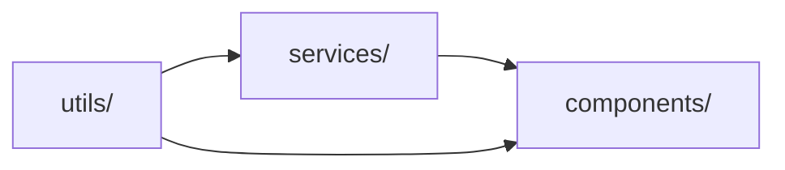
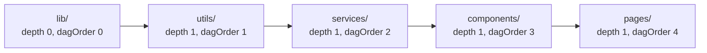

# concepts

the mental model behind the grimuah project

[README.md](README.md) has the install and the command reference, [RULES.md](RULES.md) has the rule table, and [PHILOSOPHY.md](PHILOSOPHY.md) has the why

this document defines the vocabulary the rest of grimuah is written in

---

## table of contents

- [identity](#identity)
- [surfaces](#surfaces)
- [innate members](#innate-members)
- [the dag in practice](#the-dag-in-practice)
- [the config file](#the-config-file)
- [the enforcement tiers](#the-enforcement-tiers)

---

## identity

identity describes the structural role a file plays in the codebase

defining identity for a folder means encoding three things

**naming contract**: any file in this set must be named with a suffix matching the folder's name

a service file has `.service.ts`, a component file has `.component.ts`

the suffix tells you the role before you open the file

**contractual obligation**: the file must follow the rules of its surface

a service does not throw errors, it returns `Outcome`

a component does not import from deeper surfaces than its own

these are not recommendations, they are enforced by a static check

**scope of operation**: the file operates within what the surface's name means linguistically

a service orchestrates business logic, a component renders presentation, a guard checks permissions

when the scope is clear, so is responsibility

consider `sync-subscription.service.ts` in `services/`

the suffix tells you it is a service

its contract says it returns outcomes instead of throwing

its scope says it orchestrates subscription logic

it does not render UI, does not write raw database queries, does not define its own permission model

three pieces of information available before you read a single line of implementation

a folder with identity stops being a bucket and becomes a boundary

the boundary has rules, everything inside is subject to them

---

## surfaces

a folder with identity is a surface

a surface is a boundary with declared rules about what lives inside, who can cross the boundary, and what obligations the citizens carry

think of `src` as a set

each subfolder is a subset at a specific resolution

`services/` is the set of service-citizens, `components/` is the set of component-citizens

the two sets do not share edges by default

a citizen of a surface inherits three things from its hosting surface

**identity**: the citizen must match the surface's naming contract, contractual obligation, and scope

a file cannot call itself a service-citizen if it is named `*.component.ts`

**position**: the citizen sits at the surface's depth in the filesystem and its order in the import dag

depth controls where the directory lives, dagOrder controls who can import from whom

depth and dagOrder are two distinct parameters because the file tree and the dependency graph are different things

**constraints**: the citizen may import from the surfaces the dag already permits, plus any extra edges the surface's `allowedImports` lists

the citizen's own exports flow downstream to surfaces with a higher dagOrder, never upstream

this creates a directed graph where every edge carries a contract

when `services/` exports a type consumed by `components/`, that type defines the shape of data crossing the edge

the consumer depends on the producer

the producer cannot depend on the consumer

here is the default preset's graph



each arrow is an allowed import direction

components can import from services and from utils, the reverse is a structural violation

surfaces at the same dagOrder level do not see each other unless explicitly configured

the graph is not documentation

it is declared in `architecture.config.json`

`grimuah check` validates every import against it

---

## innate members

some file types do not have a natural home in any single surface

a type definition belongs to the surface that owns the data, not to a global `types/` folder

config belongs to the surface that uses it, not to a central `config/` directory

tests belong alongside the code they test, not in a separate `tests/` tree

regex patterns belong to the surface that matches them, not in a shared `regex/` file

the traditional approach creates a folder for each of these

the grimuah approach is different

these file types become citizens of whichever surface needs them

they follow the same naming rules, import constraints, and scope obligations as any other citizen

they provide only the context and nuance required to justify their existence

the shipped surfaces use these innate member suffixes

**`.types.ts`**: type definitions and contracts

when `services/` defines a `SubscriptionStatus` type, it lives in `services/subscription.types.ts`

the type inherits the surface's dagOrder

it cannot be imported by surfaces with a lower dagOrder

**`.config.ts`**: config, constants, and enums

config lives next to its consumer

a config file follows the same import constraints as any other file in its surface

a config also has to earn its file, because three constants under one roof are still three constants

the rules that name a config as the destination ask what the config would hold before they speak: an enum member is one entry, a string literal written outside an enum is one entry, a member's own value is part of the member rather than a second entry, and fewer than four entries is no config at all

a config the surface already holds is the one exception, because adding to that one creates nothing

[RULES.md](RULES.md#structural) lists the three rules that read the count and [PHILOSOPHY.md](PHILOSOPHY.md#everything-must-justify-its-existence) covers the test behind it

**`.spec.ts`**: tests

tests live alongside the code they test

lifting tests to a central `tests/` directory breaks the co-location principle

**`.regex-patterns.ts`**: documented regular expressions in a single source of truth

every regex is a named constant with a JSDoc comment explaining what it matches

no inline regex littered through the surface's code

a preset also uses surface-specific innate members, such as `schema.ts` for `db/`

innate members inherit their hosting surface's depth and dagOrder

a type defined in `components/` cannot be imported by `services/`

it is not a global type, it is a local contract

the shallowest common ancestor rule governs sharing

if a type is needed by two sibling surfaces, lift it to their shared parent

if `services/` and `components/` both need the same type, it moves to `lib/` or the appropriate utility surface

the type never moves downward

moving a type up is a deliberate act of sharing, not the default position

---

## the dag in practice

### depth and dagOrder

two parameters control where a surface sits in the project

**depth** is physical, it describes where the directory lives in the file tree

`lib/` at the project root has depth 0, `src/services/` has depth 1

this is purely filesystem layout

**dagOrder** is logical, it describes where the surface sits in the import dag

a surface with dagOrder 3 can import from surfaces with dagOrder 0, 1, or 2

it cannot import from dagOrder 4, 5, or 6 unless `allowedImports` explicitly grants the edge

depth and dagOrder are independent because the file tree and the dependency graph are different things

multiple surfaces can share the same file depth with different dagOrders

`utils/` and `services/` are both at depth 1 in the webapp preset

`utils/` has dagOrder 1 and `services/` has dagOrder 2, so services can import from utils and utils cannot import from services

the file tree has nothing to do with it

here is the webapp preset's graph



each arrow is an allowed import direction

a surface may import from any surface with a lower dagOrder, so the chain is the minimal set of edges and the rest are implied

surfaces at the same dagOrder do not share an edge unless `allowedImports` explicitly lists it

### allowed imports

the `allowedImports` field on each surface declares extra edges beyond the ones the dag already implies

this is where a same-dagOrder grant or a shallow-to-deep grant is written down

```
{
  "name": "services",
  "path": "src/services",
  "depth": 1,
  "dagOrder": 1,
  "suffixes": [".service.ts"],
  "innateMembers": [".types.ts", ".config.ts", ".spec.ts"],
  "allowedImports": []
}
```

this declaration adds no edge of its own, so `services/` may import only from the surfaces the dag already permits

an entry naming a surface at a lower dagOrder is redundant, because the dag already grants it, and the `redundant-allowed-import` rule reports it

every extra edge in the dag is declared here, there is no implicit connectivity between surfaces at the same dagOrder

---

## the config file

the full `architecture.config.json` includes surfaces, layers, an optional `rules` map, an optional `sourceRoots` list, and an optional rootLib

grimuah generates this file into every scaffolded project, it is not part of this repository

```
{
  "surfaces": [
    {
      "name": "utils",
      "path": "src/utils",
      "depth": 1,
      "dagOrder": 0,
      "suffixes": [".util.ts"],
      "innateMembers": [".types.ts", ".config.ts", ".spec.ts", ".regex-patterns.ts"],
      "allowedImports": []
    },
    {
      "name": "services",
      "path": "src/services",
      "depth": 1,
      "dagOrder": 1,
      "suffixes": [".service.ts"],
      "innateMembers": [".types.ts", ".config.ts", ".spec.ts"],
      "allowedImports": []
    },
    {
      "name": "components",
      "path": "src/components",
      "depth": 1,
      "dagOrder": 2,
      "suffixes": [".component.ts"],
      "innateMembers": [".types.ts", ".config.ts", ".spec.ts"],
      "allowedImports": []
    }
  ],
  "layers": {
    "cosmetic": true,
    "structural": true,
    "resilience": true,
    "behavioural": true
  },
  "rules": {
    "switch-statement": false
  }
}
```

the config is the single source of truth for the architecture

the CLI reads it to validate imports, check naming, and run the pre-passes

the rule engine reads it to decide which rules run

the [schema](src/architecture.schema.json) validates it at authoring time with editor autocomplete

the same schema is written into every scaffolded project, so an editor autocompletes the keys there too

`grimuah check` parses the file with the binary's own typed reader and validates it before any rule runs

there is no second config file, no hidden convention, no documentation that contradicts the graph

`layers` toggles a whole category of rules and `rules` toggles one rule by name

[RULES.md](RULES.md#turning-a-single-rule-off) covers both switches

---

## the enforcement tiers

architectural rules fall into two tiers that compose into a single check run

not all rules can be enforced at the same level, and both tiers run in the same process

### tier one: the rule engine

token-level and tree-level rules run inside `grimuah check` itself

these operate on the tokens of the source and on the tree the front-end builds from them, and they detect patterns in the code itself

the resilience, behavioural, and hygiene layers are enforced here, along with the structural rules that read declarations

switch statements, c-style for loops, let bindings, null literals, `as any` casts, chained casts, proxy re-exports, const-as-enum patterns, and loose equality are matched structurally

throw statements, bare catches, and silent discards are matched the same way

duplication, enum placement, import cycles, and unused-binding rules read the run rather than the file, and the engine builds the index they need once per run

the engine is the binary, so there is nothing to install and nothing to configure

[src/lang/](src/lang) holds the front-ends, [src/ir.zig](src/ir.zig) holds the tree they build, and [src/rules/](src/rules) holds the rules

### tier two: CLI pre-passes

file-path-level and file-content-level rules run as CLI pre-passes inside `grimuah check`

these operate on the filesystem rather than the syntax tree

the cosmetic and structural layers rely on this tier for rules that need the filesystem rather than the syntax tree

| Pre-pass                        | What it checks                                                                                               |
| ------------------------------- | ------------------------------------------------------------------------------------------------------------ |
| Folder suffix validation        | Every file in a surface directory must use one of the surface's declared suffixes or an innate member suffix |
| Centralised directory detection | Directories named `config/`, `types/`, or `models/` under `src/` are flagged                                 |
| Import firewall                 | Every import in every file is resolved to a surface and checked against the surface's `allowedImports` list  |
| Innate member depth scoping     | A `.types.ts` or `.config.ts` file may not import from a surface deeper than its own, so a contract never depends on an implementation       |
| Singleton warnings              | Surfaces containing exactly one file trigger a warning                                                       |

the import firewall pre-pass extracts imports by scanning file content for six import patterns

it handles multi-line imports, dynamic imports, side-effect imports, and backslash-escaped paths

this is a linear scan, not a full parser

it covers the patterns that appear in practice

### how they compose

`grimuah check` runs the CLI pre-passes on a worker thread while the rule engine takes the remaining cores

both must pass for the check to succeed

each tier enforces the rule layers that are enabled in `architecture.config.json`

if structural is disabled, the pre-pass skips the import firewall and singleton checks

if resilience is disabled, the engine skips the resilience rules

the hygiene layer has no toggle of its own, so it runs whenever the engine runs

an error-severity finding fails the run

a warning-severity finding is reported without failing it
