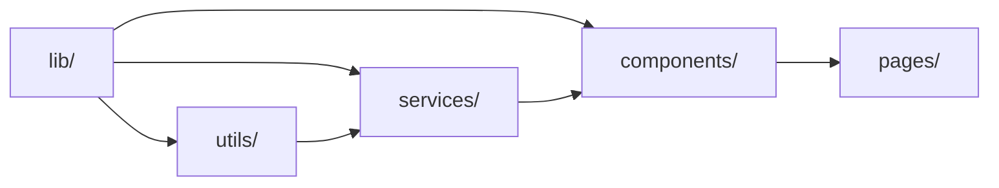
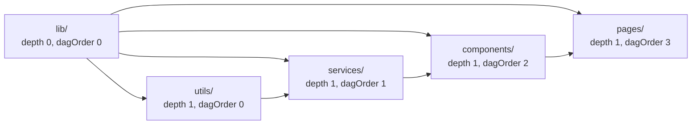

# archi-cade

[](https://ziglang.org/)
[](https://www.typescriptlang.org/)
[](https://biomejs.dev/)
[](LICENSE)

A standalone Zig CLI (~260KB, zero runtime dependencies) that scaffolds TypeScript projects with a declaratively-configured, machine-enforced graph architecture and ships a two-tier linting system across four independently toggleable layers

Conventional folder layouts group by category, not by dependency

This tool treats each folder as a surface with a declared identity, an import firewall, and enforceable obligations

The rest is scaffolding, lint rules, and a ~260KB binary

---

## Table of Contents

- [Core Principles](#core-principles)
- [The Four Rule Layers](#the-four-rule-layers)
- [Identity](#identity)
- [Surfaces](#surfaces)
- [Innate Members](#innate-members)
- [The DAG in Practice](#the-dag-in-practice)
- [The Enforcement Tiers](#the-enforcement-tiers)
- [Presets and Commands](#presets-and-commands)

---

## Core Principles

### Everything must justify its existence

No speculative abstractions, no pattern applied before its scale earns it

A folder with one file has not earned its place as a surface, it is a leaf node that belongs at a higher scope

A configuration option that never changes is not configuration, it is a hardcoded value with extra indirection

A lint rule that never fires is noise

Justification does not mean aggressive deletion

It means awareness

Every surface, every file, every abstraction should carry a mental note of why it exists

When the justification is gone, the thing should go with it

### Identity defines the boundary

A folder that only groups files by category is a bucket, and buckets are solely managed through hidden social contracts

So instead of buckets, we use identities

Identity has three parts

- **Naming contract**: a file's suffix must match its folder's name
- **Contractual obligation**: the file must adhere to its surface's rules
- **Scope of operation**: the file operates within its surface's linguistic boundary

The suffix tells you the role, the contract tells you the rules, the scope tells you the responsibility

This principle is what transforms a conventional directory tree into an enforceable graph

Without identity, every folder is equally addressable and there is no structural reason one should not import from another

With identity, the boundary is declared and enforced

### Co-location is the default, abstraction is the exception

Types live next to the surface that owns them

Configuration lives next to the code that reads it

Tests live next to the code they verify

Patterns live next to the surface that matches against them

Lifting to a shared location is a deliberate act gated by proven need

The shallowest common ancestor rule governs when sharing is warranted

Two surfaces that need the same type lift it to their shared parent, not to a global namespace

This principle avoids the trap of premature abstraction

A type that lives in a central `types/` folder is accessible to the entire project whether it belongs there or not

A type that lives in `services/subscription.types.ts` is accessible only to surfaces that have an edge to `services/`

Scoping is the default, exposure is earned

### Living rules over documentation

Architecture that is not enforced is aspirational

A style guide that lives in a wiki and is referenced during code review decays with every PR

A rule that blocks a violating import before it lands is worth a hundred paragraphs of documentation

This generator encodes architectural rules as static analysis

The import graph is declared in `architecture.config.json`

File naming, suffix conventions, and surface membership are checked by CLI pre-passes

AST-level patterns are enforced by GritQL plugins running in Biome

---

## The Four Rule Layers

Architectural rules are grouped into four layers

Each layer targets a distinct class of problem and can be toggled independently in `architecture.config.json`

This lets a project adopt the layers that match its maturity and concerns without committing to all four at once

### Cosmetic

Surface-level readability and naming consistency

| Rule                                                                               | Why                                                                                                                                                                                   |
| ---------------------------------------------------------------------------------- | ------------------------------------------------------------------------------------------------------------------------------------------------------------------------------------- |
| Files must use a suffix declared for their surface                                 | A `.handler.ts` file in `services/` is a violation because `services/` allows `.service.ts` and `.config.ts` as surface suffixes, plus innate members like `.types.ts` and `.spec.ts` |
| Centralised `config/`, `types/`, or `models/` directories under `src/` are flagged | These represent the old approach of grouping by category rather than by identity                                                                                                      |
| Em-dashes are banned in strings, templates, and comments                           | They serve no structural purpose and create inconsistency across the codebase                                                                                                         |

### Structural

Graph integrity and surface membership

| Rule                                                                                             | Why                                                                                                                               |
| ------------------------------------------------------------------------------------------------ | --------------------------------------------------------------------------------------------------------------------------------- |
| The import firewall blocks files from importing from surfaces not in their `allowedImports` list | A component importing directly from a database repository is a structural violation                                               |
| Innate members inherit their hosting surface's depth and dagOrder                                | A `.types.ts` file in `components/` cannot be imported by `services/` because it sits at a deeper position in the graph           |
| Surfaces with a single file trigger a warning                                                    | A folder with one file has not earned its place as a surface, the warning signals that the file could be lifted to a higher scope |

This layer is the core of the architecture

Without it the graph is aspirational, with it every import is validated against the declared DAG

### Resilience

Change-proofing patterns that prevent codebase fractures over time

| Pattern                           | Replacement                            | Why                                                                                                                                                                                                                                                                                 |
| --------------------------------- | -------------------------------------- | ----------------------------------------------------------------------------------------------------------------------------------------------------------------------------------------------------------------------------------------------------------------------------------- |
| `switch`                          | Dispatch table using `Record` or `Map` | A switch decouples the discriminant from its handler, every new case requires finding and modifying an existing block, and exhaustiveness is a runtime concern rather than a compile-time guarantee                                                                                 |
| C-style `for`                     | `map`, `filter`, `reduce`, `for..of`   | Every for loop is a re-implementation of a generalised operation, writing out the iteration mechanics repeatedly across the codebase duplicates logic that a named operator handles once with a clear contract and known semantics                                                  |
| `let`                             | `const`                                | A let binding signals mutability without conveying what mutates or why, const makes the invariant explicit at the declaration site and eliminates an entire class of accidental reassignment bugs                                                                                   |
| `null`                            | `undefined`                            | Null is the zero-depth base of the prototype chain, when property lookup reaches null and the key is not found, javascript returns undefined, undefined is the language's native signal for absence and using it instead of null aligns with this fundamental language construction |
| `as any`                          | Proper types                           | As any removes the type system at exactly the call site that needs it most, the unchecked value propagates through every consumer and erases type information downstream                                                                                                            |
| Chained `as unknown as T`         | Single cast                            | Two casts that first erase all type information then assert a specific type, bypassing every structural safeguard the compiler provides                                                                                                                                             |
| Proxy re-exports                  | Direct imports                         | A file containing only `export { foo } from './bar'` creates an indirect dependency, the consumer is coupled to a pass-through file and the original module's interface is hidden behind an indirection                                                                             |
| `const + as const + keyof typeof` | `enum`                                 | Five lines of boilerplate with a self-referential type alias achieving what a single enum declaration provides with better tooling and no type gymnastics                                                                                                                           |
| `==`                              | `===`                                  | Loose equality coerces both sides to a common type before comparing, making `0 == ''` and `false == '0'` true, strict equality compares type and value matching the programmer's mental model of what equality means                                                                |

### Behavioural

Runtime safety and error handling discipline

| Rule                                 | Why                                                                                                                                                                                                       |
| ------------------------------------ | --------------------------------------------------------------------------------------------------------------------------------------------------------------------------------------------------------- |
| `throw` is banned                    | Every fallible operation returns `OperationOutcome`, a discriminated union narrowed on `succeeded`, this makes error handling explicit at every call site and eliminates invisible propagation paths      |
| Bare `catch {}`                      | An empty catch block swallows every possible error including ones the developer did not anticipate, there is no path to observability or recovery and production failures become silent                   |
| `catch { $_ }`                       | A discarded parameter does not make the silence acceptable, same structural problem as a bare catch with the additional misdirection of naming the ignored error                                          |
| Input validation at trust boundaries | Untrusted input is the root cause of most runtime failures in practice and validating at the boundary prevents malformed data from reaching deeper layers where the context of the original input is lost |

---

## Identity

Identity describes the structural role a file plays in the codebase

Defining identity for a folder means encoding three things

**naming contract**: any file that wishes to exist within this set must be named with a suffix matching the folder's name

A service file has `.service.ts`, a component file has `.component.ts`

The suffix tells you the role before you open the file

**contractual obligation**: the file must adhere to the rules of its surface

A service does not throw errors, it returns `OperationOutcome`

A component does not import from deeper surfaces than its own

These are not recommendations, they are enforced by a static check

**scope of operation**: the file operates within the scope of what the surface's name means linguistically

A service orchestrates business logic, a component renders presentation, a guard checks permissions

When the scope is clear, so is responsibility

Consider a file called `sync-subscription.service.ts` in `services/`

Its suffix tells you it is a service, its contract says it returns outcomes instead of throwing

Its scope says it orchestrates subscription logic, it does not render UI, does not write raw database queries, does not define its own permission model

Three pieces of information available before you read a single line of implementation

A folder with identity stops being a bucket and becomes a boundary

The boundary has rules, everything inside is subject to them

---

## Surfaces

A folder with identity is a surface

A surface is a boundary with declared rules about what lives inside, who can cross the boundary, and what obligations the citizens carry

Think of `src` as a set

Each subfolder is a subset at a specific resolution
`services/` is the set of service-citizens, `components/` is the set of component-citizens
The two sets do not share edges by default

A citizen of a surface inherits three things from its hosting surface

**Identity**: the citizen must match the surface's naming contract, contractual obligation, and scope

A file cannot call itself a service-citizen if it is named `*.component.ts`

**Position**: the citizen sits at the surface's depth in the filesystem and its order in the import DAG

Depth controls where the directory lives, dagOrder controls who can import from whom

These are two distinct parameters because the file tree and the dependency graph are different things

**Constraints**: the citizen may only import from surfaces listed in the surface's `allowedImports`

The citizen's own exports flow downstream to surfaces with a higher dagOrder, never upstream

This creates a directed graph where every edge carries a contract

When `services/` exports a type consumed by `components/`, that type defines the shape of data crossing the edge

The consumer depends on the producer

The producer cannot depend on the consumer

Here is the default graph



Each arrow is an allowed import direction

Components can import from services, the reverse is a structural violation

Surfaces at the same dagOrder level do not see each other unless explicitly configured

The graph is not documentation

It is declared in `architecture.config.json` and enforced by the static code analysis tooling this generator provides

---

## Innate Members

Some file types do not have a natural home in any single surface

A type definition belongs to the surface that owns the data, not to a global `types/` folder

Configuration belongs to the surface that uses it, not to a central `config/` directory

Tests belong alongside the code they verify, not in a separate `tests/` tree

Regex patterns belong to the surface that matches against them, not in a shared `regex/` file

The traditional approach is to create a folder for each of these

The archi-cade approach is different: these file types become citizens of whichever surface needs them

They abide by the same naming rules, import constraints, and scope obligations as any other citizen in that surface

They provide only the context and nuance required to justify their existence

There are four such types

**`.types.ts`**: type definitions and contracts

When `services/` defines a `SubscriptionStatus` type, it lives in `services/subscription.types.ts`

The type inherits the surface's dagOrder and cannot be imported by surfaces with a lower dagOrder

**`.config.ts`**: configuration, constants, and enums

Config lives next to its consumer

A config file follows the same import constraints as any other file in its surface

**`.spec.ts`**: tests

Tests live alongside the code they test

Lifting tests to a central `tests/` directory breaks the co-location principle

**`.regex-patterns.ts`**: documented regular expressions in a single source of truth

Every regex is a named constant with a JSDoc comment explaining what it matches

No inline regex littered through the surface's code

Innate members inherit their hosting surface's depth and dagOrder

A type defined in `components/` cannot be imported by `services/`

It is not a global type, it is a local contract

The shallowest common ancestor rule governs sharing

If a type is needed by two sibling surfaces, lift it to their shared parent

If `services/` and `components/` both need the same type, it moves to `lib/` or the appropriate utility surface

The type never moves downward

Moving a type up is a deliberate act of sharing, not the default position

---

## The DAG in Practice

### Depth and dagOrder

Two parameters control where a surface sits in the project

**depth** is physical, it describes where the directory lives in the file tree
`lib/` at the project root has depth 0, `src/services/` has depth 1
This is purely about filesystem layout

**dagOrder** is logical, it describes where the surface sits in the import DAG

A surface with dagOrder 3 can import from surfaces with dagOrder 0, 1, or 2

It cannot import from dagOrder 4, 5, or 6

These are independent because the file tree and the dependency graph are different things

Multiple surfaces can share the same file depth with different dagOrders
`utils/` and `services/` are both at depth 1, `utils/` has dagOrder 0 and `services/` has dagOrder 1
Services can import from utils, utils cannot import from services, the file tree has nothing to do with it

Here is the default graph for a webapp preset



Each arrow is an allowed import direction

Surfaces at the same dagOrder do not share an edge unless `allowedImports` explicitly lists it
`utils/` and `services/` are at different dagOrders so the edge runs one way
Two surfaces at the same dagOrder would not see each other at all

### Allowed imports

The `allowedImports` field on each surface declares which surfaces it may import from

This is the edge table of the graph

```json
{
  "name": "services",

  "path": "src/services",

  "depth": 1,

  "dagOrder": 1,

  "suffixes": [".service.ts", ".config.ts"],

  "innateMembers": [".types.ts", ".config.ts", ".spec.ts"],

  "allowedImports": ["utils"]

}
```

This declaration says that `services/` may import from `utils/`

Any import from `services/` to any other surface is a structural violation

Every edge in the DAG is declared here, there is no implicit connectivity between surfaces

### The config file

The full `architecture.config.json` includes surfaces, layers, and an optional rootLib

```json
{
  "surfaces": [

    {

      "name": "utils",

      "path": "src/utils",

      "depth": 1,

      "dagOrder": 0,

      "suffixes": [".util.ts", ".config.ts"],

      "innateMembers": [

        ".types.ts",

        ".config.ts",

        ".spec.ts",

        ".regex-patterns.ts"

      ],

      "allowedImports": []

    },

    {

      "name": "services",

      "path": "src/services",

      "depth": 1,

      "dagOrder": 1,

      "suffixes": [".service.ts", ".config.ts"],

      "innateMembers": [".types.ts", ".config.ts", ".spec.ts"],

      "allowedImports": ["utils"]

    },

    {

      "name": "components",

      "path": "src/components",

      "depth": 1,

      "dagOrder": 2,

      "suffixes": [".component.ts", ".config.ts"],

      "innateMembers": [".types.ts", ".config.ts", ".spec.ts"],

      "allowedImports": ["utils", "services"]

    }

  ],

  "layers": {

    "cosmetic": true,

    "structural": true,

    "resilience": true,

    "behavioural": true

  }

}
```

The config is the single source of truth for the architecture

The CLI reads it to validate imports, check naming, and run pre-passes

The schema validates it at authoring time with editor autocomplete and at runtime during every `arch check`

There is no second config file, no hidden convention, no documentation that contradicts the graph

---

## The Enforcement Tiers

Architectural rules operate at two different levels of the codebase

Not all rules can be enforced at the same level, so the tool uses two tiers that compose into a single check run

### Tier one: GritQL plugins

AST-level rules run inside Biome as GritQL plugins

These operate on the parsed syntax tree and detect patterns in the code itself

The resilience and behavioural layers are enforced here

Switch statements, c-style for loops, let bindings, null literals, as any casts, chained casts, proxy re-exports, const-as-enum patterns, and loose equality are all detected by matching their AST structure

Throw statements, bare catches, and silent discards are detected the same way

Each layer produces a `.grit` file in `.arch-rules/` referenced from `biome.json`

The plugins ship with every scaffolded project and run as part of `biome lint`

### Tier two: CLI pre-passes

File-path-level rules run as CLI pre-passes before Biome is invoked

These operate on the filesystem and the content of files rather than the syntax tree

The cosmetic and structural layers rely on this tier for rules that GritQL cannot express

| Pre-pass                        | What it checks                                                                                               |
| ------------------------------- | ------------------------------------------------------------------------------------------------------------ |
| Folder suffix validation        | Every file in a surface directory must use one of the surface's declared suffixes or an innate member suffix |
| Centralised directory detection | Directories named `config/`, `types/`, or `models/` under `src/` are flagged                                 |
| Import firewall                 | Every import in every file is resolved to a surface and checked against the surface's `allowedImports` list  |
| Innate member depth scoping     | A `.types.ts` file in a deeper surface cannot import from or be imported by a shallower surface              |
| Singleton warnings              | Surfaces containing exactly one file trigger a warning                                                       |

The import firewall pre-pass extracts imports by scanning file content for six import patterns

It handles multi-line imports, dynamic imports, side-effect imports, and backslash-escaped paths

This is a linear scan, not a full parser, and it covers the patterns that appear in practice

### How they compose

`arch check` runs the CLI pre-passes first, then invokes `biome lint`
Both must pass for the check to succeed

Each tier enforces the rule layers that are enabled in `architecture.config.json`

If structural is disabled, the pre-pass skips the import firewall and singleton checks

If resilience is disabled, Biome skips the `.grit` file for that layer

---

## Presets and Commands

### Presets

Five presets ship with the binary

Each preset defines a surface configuration for a common project archetype

| Preset  | Surfaces                                                             | Root lib |
| ------- | -------------------------------------------------------------------- | -------- |
| default | utils, services, components                                          | No       |
| webapp  | lib, utils, services, components, pages                              | Yes      |
| cli     | lib, utils, services, commands                                       | Yes      |
| backend | lib, db, services, middleware                                        | Yes      |
| bot     | lib, db, services, middleware, components, commands, tasks, handlers | Yes      |

The init command with no `--preset` flag uses the default preset and asks zero questions

Interactive refinement adds optional surfaces not already in the chosen preset

The tool asks up to five yes or no questions covering lib, db, pages, commands, middleware, and tasks

Each question is skipped when the surface is already present in the preset

Adding lib shifts it to depth 0 and shifts existing surfaces down

Adding middleware inserts it between services and components in the DAG order

### Commands

**`init [name] [--preset <name>]`**

Scaffolds a new project with folder structure, architecture config, Biome config, TypeScript config, `package.json`, `.gitignore`, husky pre-commit hooks, and generated GritQL rule files

Interactive refinement asks only about surfaces not already in the chosen preset

Templates produce output that passes Biome format without modification

**`check`**

Runs CLI pre-passes for cosmetic and structural rules then invokes `biome lint` for resilience and behavioural rules

Both tiers must pass for a zero exit code

Pre-passes can be skipped by disabling the corresponding layer in the config

**`add <surface-name>`**

Creates a new surface directory with an example file, updates `architecture.config.json`, and regenerates GritQL rules

Suffixes are determined by a heuristic mapping surface names to their expected file types

A `validators` surface gets `.validator.ts` and `.config.ts` suffixes

A `guards` surface gets `.guard.ts` and `.config.ts`

A `repositories` or `states` surface gets the corresponding suffix

Any unknown surface name uses a generic fallback

**`remove <surface-name>`**

Deletes the surface directory, strips the surface from `architecture.config.json` including all `allowedImports` entries across every surface, compacts the dagOrder values, and regenerates GritQL rules

**`upgrade`**

Detects the closest matching preset, adds any preset surfaces not already in the current configuration, and preserves user modifications including layer toggles and custom surfaces

Reports when the configuration is already up to date
